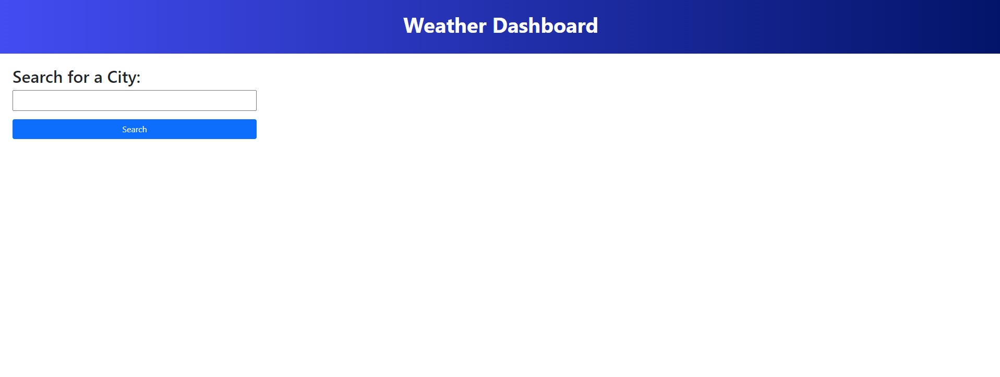
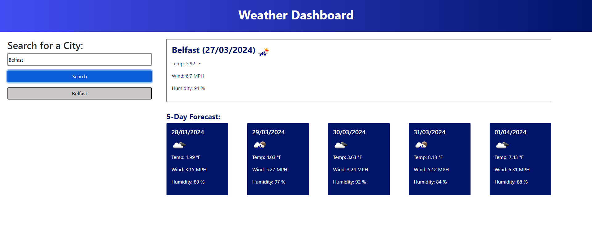
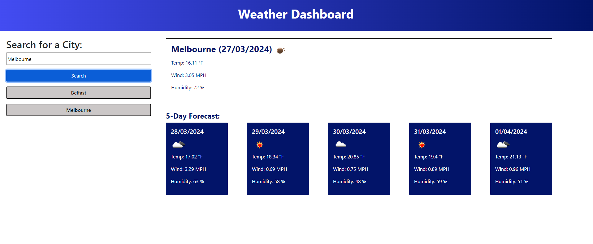

# Weather Dashboard

A single page website that calls on Open Weather API for updates on weather in their searched city. 
> Live demo [_here_](https://gaylemcclure.github.io/weather-dashboard/).

## Table of Contents
* [General Info](#general-information)
* [Technologies Used](#technologies-used)
* [Features](#features)
* [Screenshots](#screenshots)
* [Usage](#usage)
* [Contact](#contact)

## General Information
With this weather dashboard, you are able to search the name of a city and view the current weather alongside a 5 day future forecase. Once searched, this city will show below the search bar, and you are able to quickly repeat searches by clicking on the city name. 

## Technologies Used
- HTML
- CSS
- Javascript
- Bootstrap
- Dayjs (Plus UTC plugin)

## Features
- Search for city name
    - this uses the Open Weather geo API to fetch the coordinates of the first city that matches
    - Using the coordinates, it calls the 5 day forcast API from Open Weather
    - Separates the data into today and future
    - Creates HTML elements showing the city, date, weather icon, temp, wind and humitidy for the next five days. 
- Saving city name
    - Once a city has been searched, it is stored in local storage
    - On page load, a button appears for each city saved
    - Click on the button repeats the search for that city
    - New cities are added to the list when searched. 

## Screenshots

## Usage
1. Input a city name
2. Click search button
3. Wait for the data to appear
4. Check a button has appeared below the search bar with that city name
5. Search a second city
6. Click one of the previous searched city name buttons
7. Check that the data updates to the new city
8. Refreshing the page - check that the searched cities list still shows
9. Rest of the data should disappear 

## Contact
Created by Gayle McClure.

